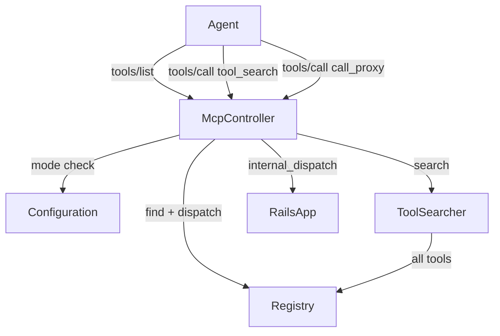
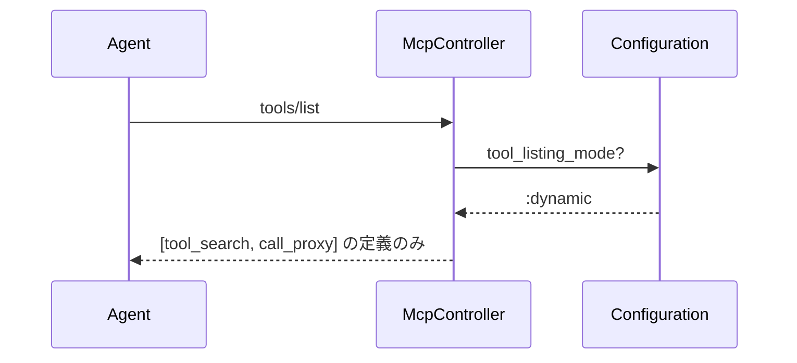
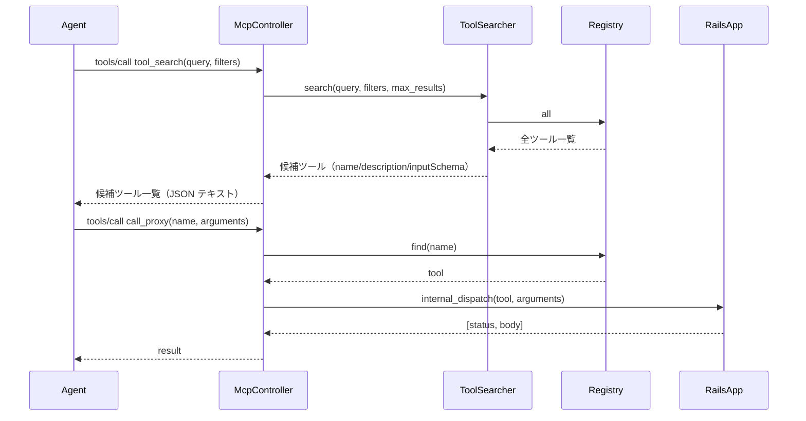

# 設計書：動的ロードモード（Dynamic Mode）

## 概要

`tools/list` が返すツール定義数を極小化する **dynamic mode** を `monkey_mcp` に追加する。  
dynamic モードでは `tools/list` の応答を `tool_search`（ツール検索）と `call_proxy`（ツール代理実行）の 2 ツールに絞り込む。エージェントは自然言語クエリで必要なツールを検索してから実行できるようになり、起動時のコンテキスト消費を大幅に削減できる。

---

## ゴール / 非ゴール

### ゴール
- `tool_listing_mode: :dynamic` 設定時に `tools/list` を 2 ツールのみに絞り込む
- キーワードマッチング（BM25 相当）による `tool_search` を実装する
- 既存の `internal_dispatch` を再利用した `call_proxy` を実装する
- `tool_listing_mode: :full`（デフォルト）では既存動作を完全に維持する
- 検索アルゴリズムを将来の embedding 差し替えに備えて抽象化する

### 非ゴール
- ベクトル検索（embedding）の初期実装
- ツール単位の RBAC/ABAC 認可
- MCP プロトコルバージョン 2025 系への対応

---

## 要件トレーサビリティ

| 要件 ID | コンポーネント |
|---------|--------------|
| 1.1, 1.2, 1.3, 1.4 | `Configuration`, `Toolable/Registry`, `McpController#handle_tools_list` |
| 2.1–2.8 | `ToolSearcher`, `McpController#handle_tool_search` |
| 3.1–3.4 | `McpController#handle_call_proxy` |
| 4.1–4.3 | `Configuration`（デフォルト値）, `McpController` |
| 5.1–5.4 | `Configuration` |
| 6.1 | `McpController`（Invalid params のエラー統一） |
| NFR-1 | `ToolSearcher`（線形スキャン、1000 件以下で 1000ms 以内） |
| NFR-2 | `ToolSearcher`（抽象インターフェース） |
| NFR-3 | `McpController#handle_call_proxy`（Registry 検索＋エラー処理） |

---

## アーキテクチャ

### 変更対象ファイル

```
lib/monkey_mcp/
├── configuration.rb        # [変更] dynamic mode 追加設定
├── mcp_controller.rb       # [変更] dynamic mode 分岐, tool_search/call_proxy ハンドラ追加, invalid params
├── tool_searcher.rb        # [新規] 検索アルゴリズム抽象化クラス
├── toolable.rb             # [変更] 予約語ツール名の登録制御
└── (registry.rb)           # [再利用] 既存 API を利用
```

### コンポーネント関係図



---

## システムフロー

### dynamic モード: tools/list



### dynamic モード: tool_search → call_proxy



---

## コンポーネントとインターフェース

### Configuration（変更）

```ruby
# 追加フィールド
attr_accessor :tool_listing_mode   # Symbol: :full | :dynamic（デフォルト: :full）
attr_accessor :max_search_results  # Integer（デフォルト: 10）
attr_accessor :max_tool_search_results   # Integer（デフォルト: 100）
attr_accessor :search_timeout_ms         # Integer（デフォルト: 1000）
attr_accessor :allow_meta_tool_override  # Boolean（デフォルト: false）

# initialize の追加
@tool_listing_mode  = :full
@max_search_results = 10
@max_tool_search_results = 100
@search_timeout_ms = 1000
@allow_meta_tool_override = false
```

バリデーション（`tool_listing_mode=` の setter）:
- 値が `:full` / `:dynamic` 以外 → `ArgumentError`

バリデーション（`max_search_results=` の setter）:
- 0 以下・nil・非整数 → `ArgumentError`

バリデーション（`max_tool_search_results=` / `search_timeout_ms=` の setter）:
- 0 以下・nil・非整数 → `ArgumentError`

### ToolSearcher（新規）

```ruby
module MonkeyMcp
  # ツール検索アルゴリズムを抽象化するクラス。
  # デフォルト実装はキーワードマッチング（BM25 相当の名前・description 部分一致スコアリング）。
  # 将来的に embedding ベースの実装に差し替え可能なよう、search インターフェースを統一する。
  class ToolSearcher
    # @param tools [Array<Hash>] Registry.all が返すツールハッシュの配列
    def initialize(tools)

    # @param query [String] 検索クエリ（空文字は controller 側で invalid params）
    # @param filters [Hash] :namespace (String) などのフィルタ
    # @param max_results [Integer] 最大返却件数
    # @return [Array<Hash>] name/description/inputSchema を含むハッシュの配列
    def search(query:, filters: {}, max_results: 10)
  end
end
```

**スコアリングアルゴリズム（BM25 相当の簡易実装）:**
1. `query` をスペース区切りでトークン化
2. 各ツールについて、name + description に各トークンが出現する回数をカウント
3. スコアの降順でソートし、スコア > 0 のものを `max_results` 件返す
4. `query` は non-empty を前提とし、空文字は `McpController#handle_tool_search` で `-32602` を返す

**`filters.namespace` の適用:**
- `tool[:controller].underscore` が `namespace` で始まるツールのみを検索対象にする
- 例: `namespace: "api/v1"` → controller path が `"api/v1/..."` のツールのみ対象

### McpController（変更）

#### `handle_tools_list` の変更

```ruby
def handle_tools_list(id)
  if MonkeyMcp.configuration.tool_listing_mode == :dynamic
    jsonrpc_result(id, { tools: dynamic_meta_tools })
  else
    # 既存の full モード処理（変更なし）
    tools = MonkeyMcp::Registry.all.map { ... }
    jsonrpc_result(id, { tools: tools })
  end
end
```

#### `dynamic_meta_tools`（private）

`tool_search` と `call_proxy` の MCP ツール定義（name/description/inputSchema）を返すメソッド。  
これらは `Registry` には登録しない（McpController 内部で静的に定義する）。

**tool_search の inputSchema:**
```json
{
  "type": "object",
  "properties": {
    "query": {
      "type": "string",
      "description": "検索したいツールの説明（自然言語）"
    },
    "filters": {
      "type": "object",
      "description": "絞り込みフィルタ",
      "properties": {
        "namespace": {
          "type": "string",
          "description": "コントローラのパス prefix（例: api/v1）"
        }
      }
    },
    "max_results": {
      "type": "integer",
      "description": "最大返却件数（省略時はサーバー設定値を使用）"
    }
  },
  "required": ["query"]
}
```

**call_proxy の inputSchema:**
```json
{
  "type": "object",
  "properties": {
    "name": {
      "type": "string",
      "description": "実行するツール名（tool_search で取得したツール名）"
    },
    "arguments": {
      "type": "object",
      "description": "ツールに渡す引数"
    }
  },
  "required": ["name"]
}
```

#### `dispatch_method` の変更

```ruby
case method
when "tools/call"
  case params["name"]
  when "tool_search" then handle_tool_search(id, params["arguments"] || {})
  when "call_proxy"  then handle_call_proxy(id, params["arguments"] || {})
  else                    handle_tools_call(id, params)  # 既存処理
  end
```

#### `handle_tool_search`（新規 private）

1. `arguments["query"]` を取得し、空文字・空白のみなら `-32602` を返す
2. `filters` を取得（なければ `{}`）
3. `max_results` を `arguments["max_results"] || configuration.max_search_results` で決定し、`1..configuration.max_tool_search_results` に収める（実装方針を統一）
4. `ToolSearcher.new(Registry.all).search(query:, filters:, max_results:)` を呼ぶ
5. 結果を JSON テキストとして `content[].type: "text"` 形式で返す

#### `handle_call_proxy`（新規 private）

1. `arguments["name"]` を取得（tool 名）。不正値は `-32602`
2. `arguments["arguments"]` を取得（`{}` デフォルト）
3. `Registry.find(tool_name)` → nil の場合 JSON-RPC error (-32602)
4. 既存の `internal_dispatch(tool, args)` を呼ぶ
5. 既存の `handle_tools_call` と同一形式でレスポンスを返す

---

## データモデル

新規の永続化データなし。すべてメモリ上の処理。

---

## テクノロジースタック

| レイヤー | ツール/ライブラリ | 役割 |
|---------|-----------------|------|
| Ruby | 標準ライブラリのみ | ToolSearcher のキーワードマッチング |
| Rails | 既存 `Registry`, `SchemaBuilder` | ツールメタデータ提供 |
| MCP | JSON-RPC 2.0（既存プロトコル） | tool_search/call_proxy のプロトコル層 |

---

## 設計上の決定事項

### D1: tool_search / call_proxy を Registry に登録しない
**決定:** `Registry` には登録せず、`McpController` 内で静的定義する。  
**理由:** `tool_search` 自身が `tool_search` の結果に含まれると循環・混乱が生じる。また `call_proxy` が `call_proxy` を呼べることも同様に問題になる。動的モード専用ツールは Registry の外で管理するのが最もシンプル。

### D2: ToolSearcher を独立クラスとして分離
**決定:** McpController 内に直接書かず、`ToolSearcher` クラスとして分離する。  
**理由:** NFR-2 の拡張性（将来の embedding 差し替え）を確保するため、検索ロジックのカプセル化が必要。またテストも独立して書きやすくなる。

### D3: call_proxy は tools/call の既存パス（直接呼び出し）を制限しない
**決定:** `tool_listing_mode: :dynamic` でも `tools/call` の直接ツール呼び出しは動作させる（要件 4.3）。  
**理由:** クライアント互換性と移行コストの最小化。dynamic mode は「何が見えるか」を制御するのみで、「何が呼べるか」を制限しない。

### D4: namespace フィルタは controller path の prefix マッチ
**決定:** `tool[:controller].gsub("::", "/").gsub(/Controller$/, "").underscore` が `filters[:namespace]` で始まるかで判定する。  
**理由:** `Toolable` の `_mcp_tool_name` と整合した命名規則を使う（既存コードの `controller_path` と同じ正規化）。

### D5: `tool_search` / `call_proxy` は予約語として扱う
**決定:** デフォルトでは予約語名のユーザー定義ツール登録を拒否し、`allow_meta_tool_override: true` のときのみ上書きを許可する（非推奨）。  
**理由:** dynamic mode のメタツール名衝突を防ぎ、意図しないディスパッチ乗っ取りを避けるため。

### D6: invalid params は `-32602` に統一
**決定:** `tool_search.query` 空文字、`max_results` 不正、`call_proxy.name` 不正などの入力エラーは `-32602` で返す。  
**理由:** JSON-RPC 規約に沿って、クライアント側のエラーハンドリングを単純化するため。
